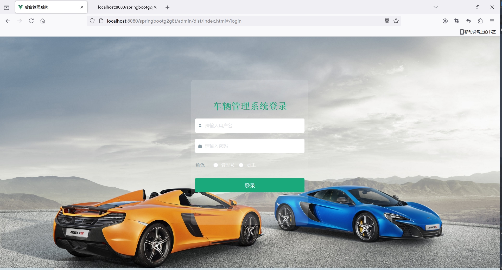
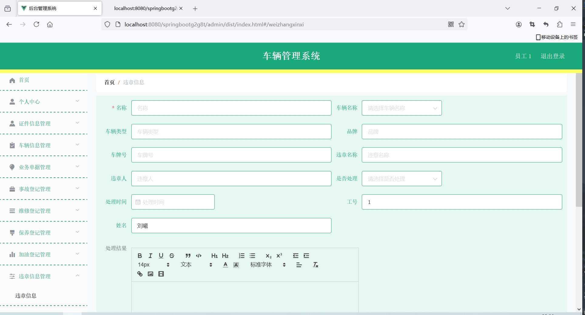
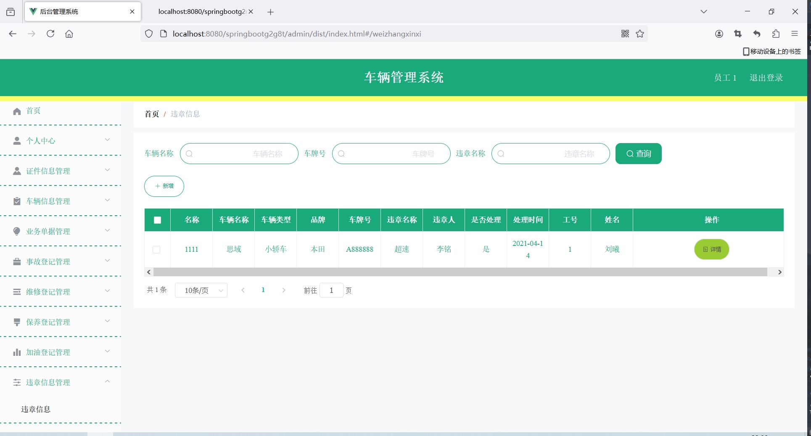
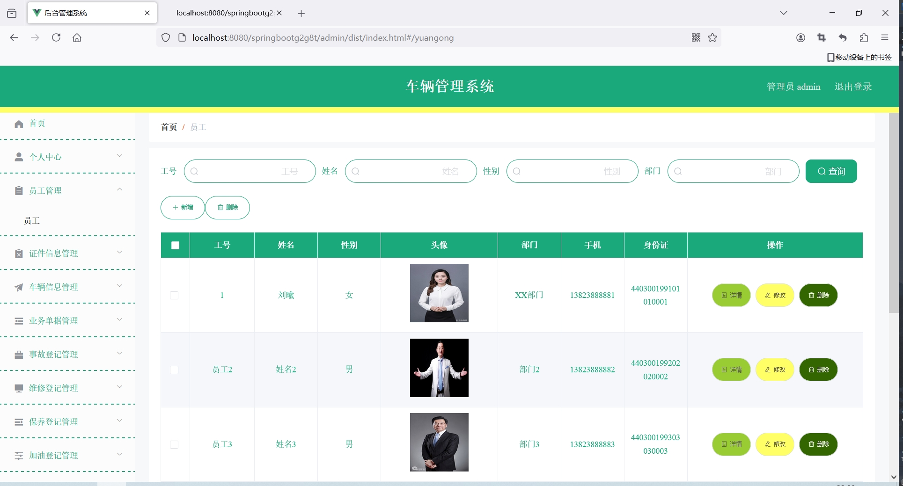
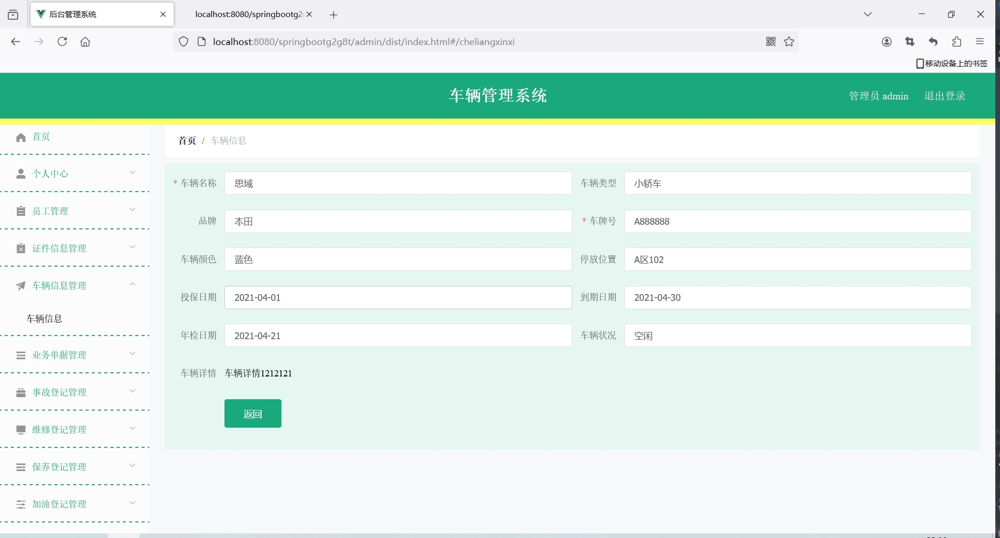
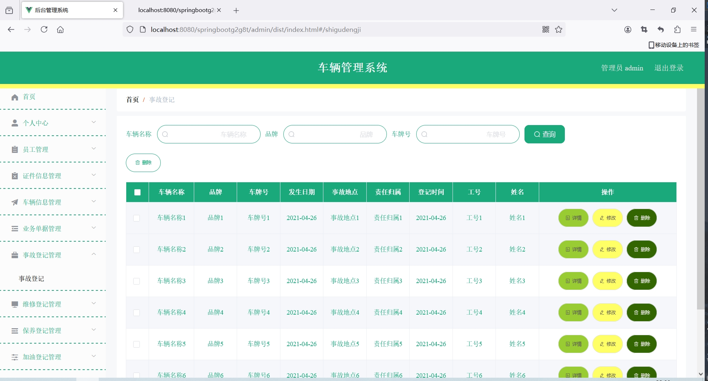
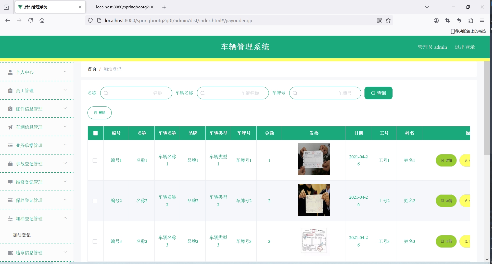

<h1 align="center">基于SpringBoot框架实现的车辆管理系统【带文档】</h1>

<h4> 完整代码获取地址：从戎源码网（https://armycodes.com/） </h4>
<h4> 作者微信：19941326836 QQ：605739993 QQ群：655392706 </h4>
<h4> 承接计算机毕设、Java毕业设计、Python毕业设计、深度学习、机器学习 </h4>
<h4> 选题+开题报告+任务书+程序定制+安装调试+论文+答辩ppt 一条龙服务 </h4>
<h4> 毕业设计所有选题地址：(https://github.com/Descartes007/allProject) </h4>

## 项目介绍

基于SpringBoot框架实现的车辆管理系统【带文档】：前端 vue、axios、elementui，后端 springboot、mybatis，系统角色分为：管理员和员工，管理员在管理后台员工信息、证件信息、车辆信息、维修登记等；员工可以对证件信息、违章信息管理等。主要功能如下：

### 管理员

- 基本操作: 登录、修改密码、获取个人信息
- 员工管理: 获取员工信息列表、筛选员工信息、查看员工信息详情、新增员工信息、修改员工信息、删除员工信息
- 证件信息管理: 获取证件信息列表、筛选证件信息、查看证件信息详情、修改证件信息、删除证件信息
- 车辆信息管理: 获取车辆信息列表、筛选车辆信息、查看车辆信息详情、修改车辆信息、删除车辆信息、新增车辆信息
- 业务单据管理: 获取业务单据列表、筛选业务单据、查看业务单据详情、修改业务单据、删除业务单据、审核业务单据
- 事故登记管理: 获取事故登记列表、筛选事故登记、查看事故登记详情、修改事故登记、删除事故登记
- 维修登记管理: 获取维修登记列表、筛选维修登记、查看维修登记详情、修改维修登记、删除维修登记
- 保养登记管理: 获取保养登记列表、筛选保养登记、查看保养记详情、修改保养登记、删除保养登记
- 加油登记管理: 获取加油登记列表、筛选加油登记、查看加油记详情、修改加油登记、删除加油登记
- 违章信息管理: 获取违章信息列表、筛选违章信息、查看违章信息详情、修改违章信息、删除违章信息

### 员工

- 基本操作: 登录、修改密码、获取个人信息、修改个人信息
- 证件信息管理: 获取证件信息列表、筛选证件信息、查看证件信息详情、新增证件信息
- 车辆信息管理: 获取车辆信息列表、筛选车辆信息、查看车辆信息详情
- 业务单据管理: 获取业务单据列表、筛选业务单据、查看业务单据详情、新增业务单据
- 事故登记管理: 获取事故登记列表、筛选事故登记、查看事故登记详情、新增事故登记
- 维修登记管理: 获取维修登记列表、筛选维修登记、查看维修登记详情、新增维修登记
- 保养登记管理: 获取保养登记列表、筛选保养登记、查看保养记详情、新增保养登记
- 加油登记管理: 获取加油登记列表、筛选加油登记、查看加油记详情、新增加油登记
- 违章信息管理: 获取违章信息列表、筛选违章信息、查看违章信息详情、新增违章信息

## 环境

- <b>IntelliJ IDEA 2020.3</b>

- <b>Mysql 5.7.26</b>

- <b>Maven 3.6.3</b>

- <b>JDK 1.8</b>

## 运行截图

n
